## Exercise: Create wireframe in Figma

## Introduction

In a previous lesson, you went through the steps to create a wireframe for the online ordering home page for the “Little Lemon” mobile version of the website. In this exercise, you will create the wireframe of the product detail page.

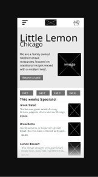 

<strong>Note:</strong> In wireframes, no color or images are included. It is just a blueprint. All that is important here is the layout and functionality.

## Instructions

To create your wireframe, you should complete the following steps:

<strong>Steps 1-5:</strong> Setting up your frame, grid and content placement.

<strong>Steps 6-12:</strong> Designing your content.

Let’s start!

<strong>Step 1: Gather Requirements</strong>

Here you write down or sketch out what you require to go on to the page, such as the:

-   Navigation bar

-   Photo of the dish

-   Delivery time

-   Customize the dish

-   Number of dishes to order

-   Add to basket button

<strong>Step 2: Create a frame and grid</strong>

-   Open a new Figma file and create a frame.

-   Select the iPhone 13 Pro Max – 1.

-   Add a 4-column grid with a margin of 25.

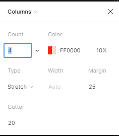

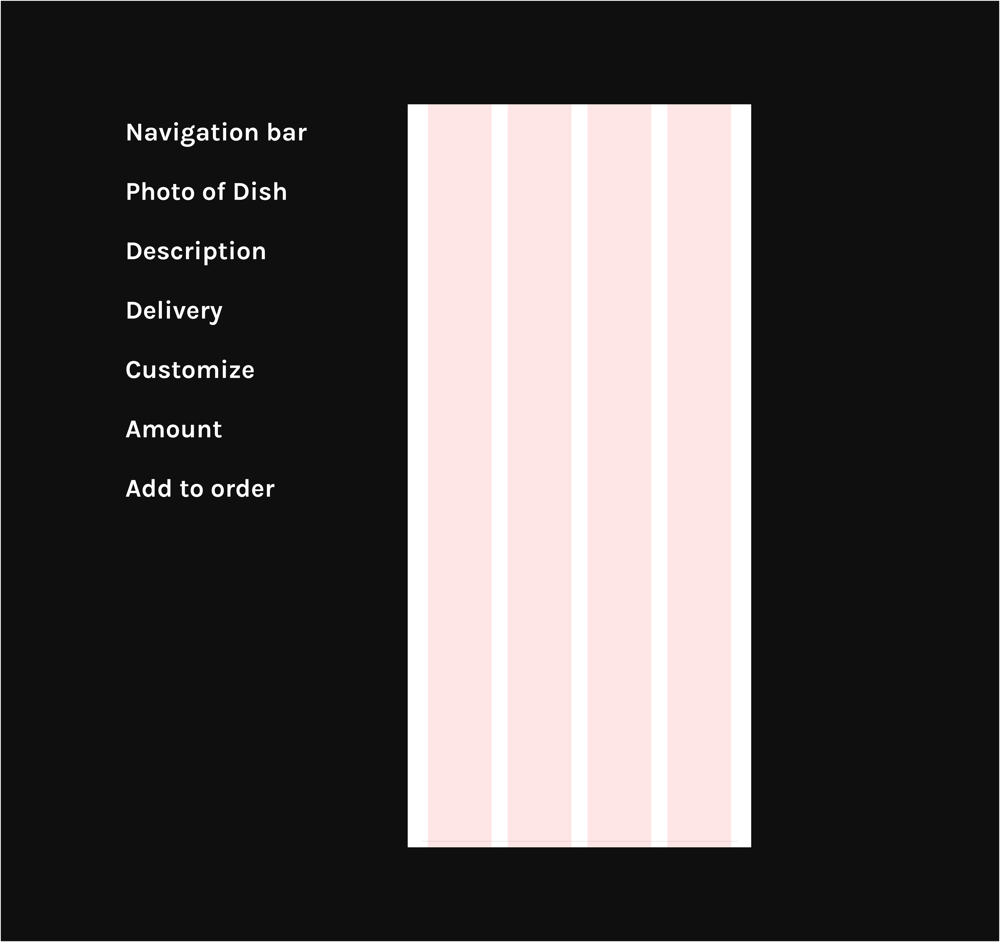  

<strong>Step 3: Content block</strong>

-   Construct a content block guide, using basic rectangles for each block.

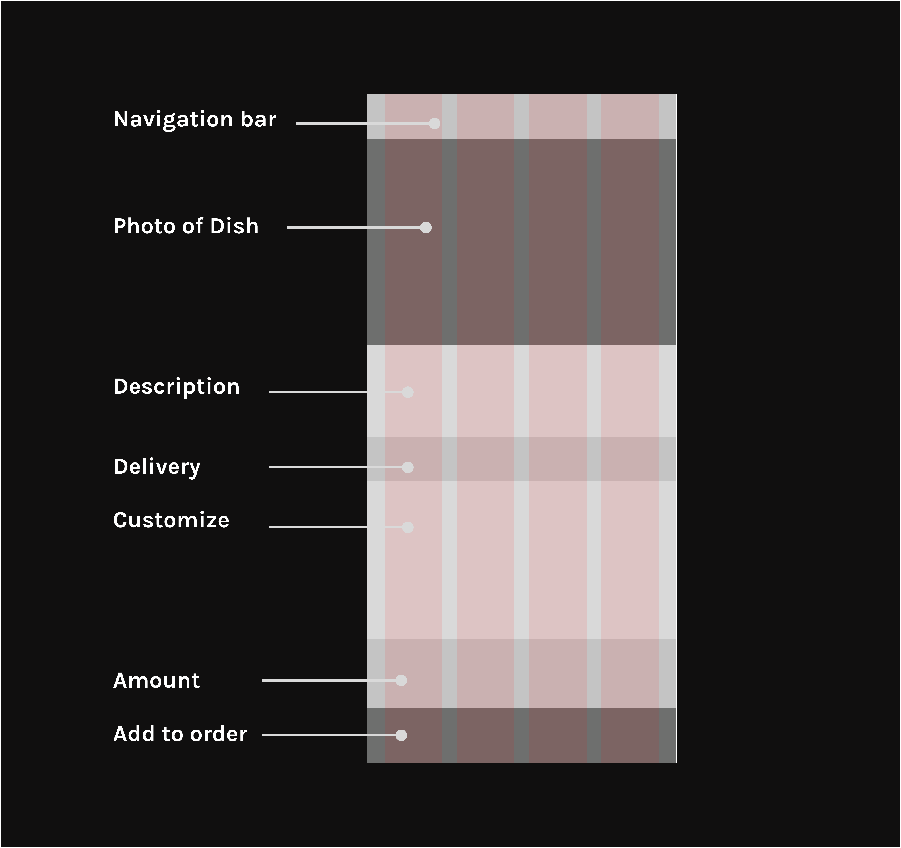  

<strong>Step 4</strong>

-   Move these guides out of the frame.

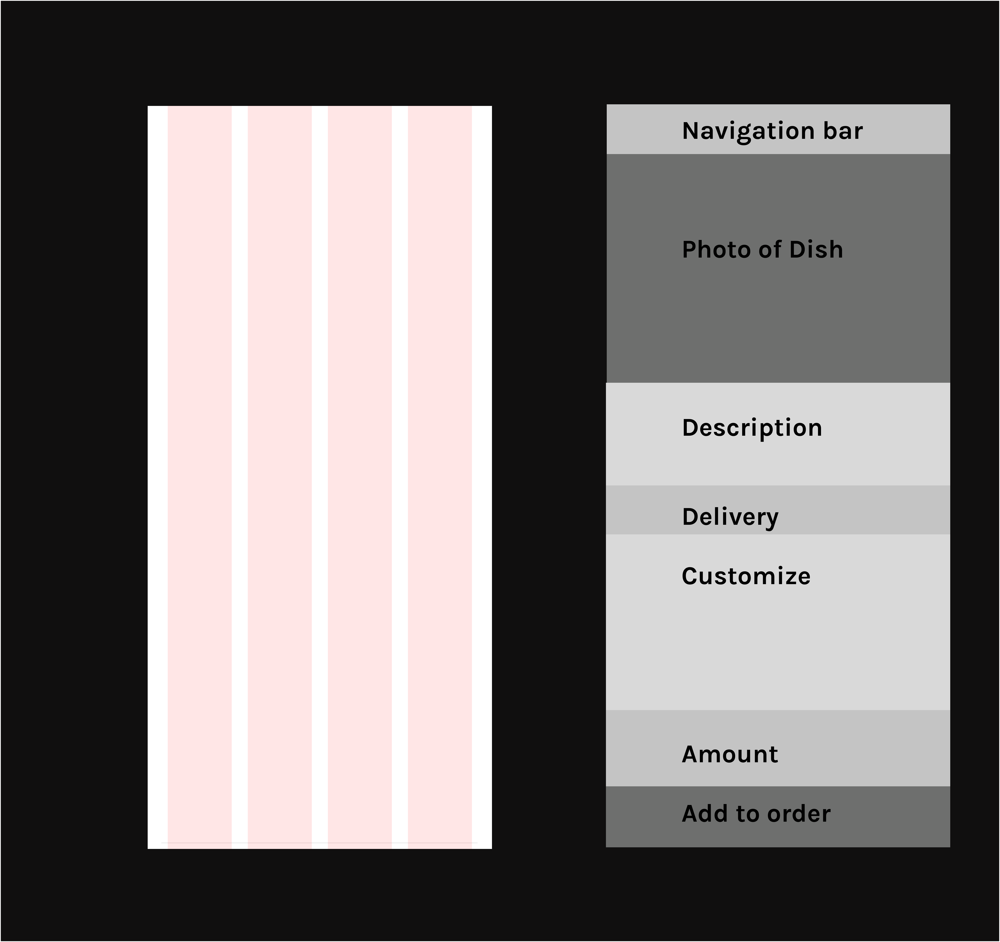  

<strong>Step 5</strong>

-   Reduce the width of the guide rectangles.

-   Keep the text as this provides a rough outline of all the content in the wireframe. You will use it as a reference while designing within the frame.

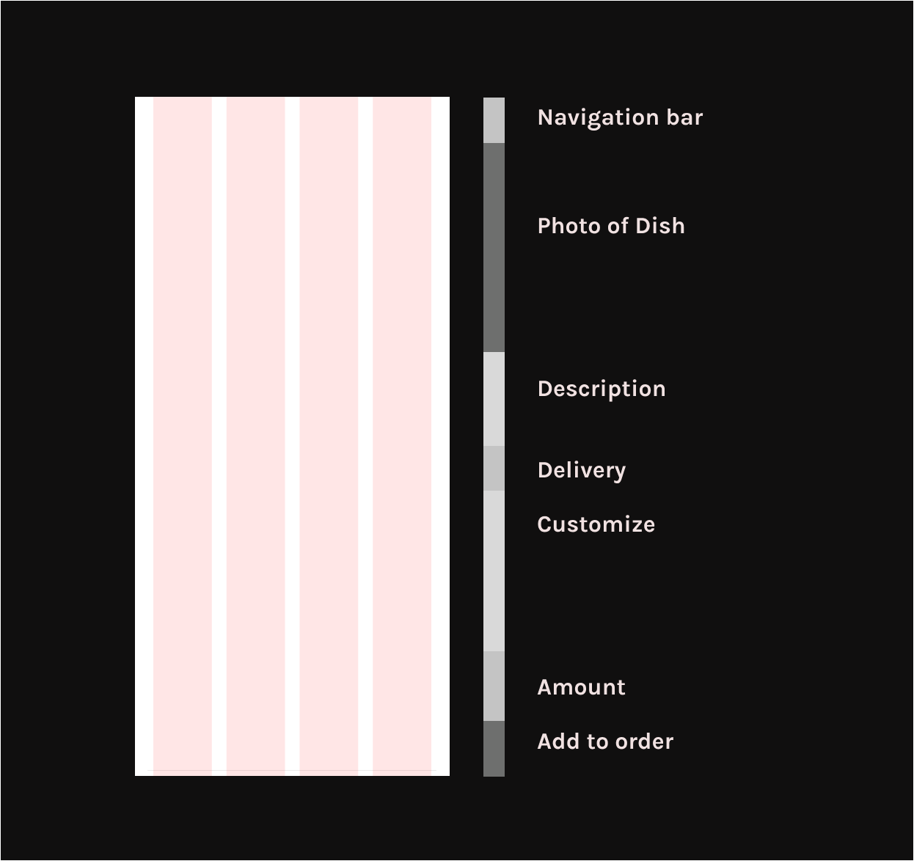  

<strong>Step 6: Header/ Navigation bar

Contents</strong>

-   Add a menu icon. A way to navigate to the home screen is to use a hamburger menu to open a side menu as I have used in this example. This helps the user to easily navigate to other pages on the site.

<strong>Note:</strong> Your navigation does not need to be detailed because it is usually secondary to the wireframe.

-   Add a logo so users recognize what site they are on.

-   Add a shopping basket as it’s an online delivery service. When the basket is tapped, it opens up a pop-up overlay that allows users to track and alter what they intend to purchase. It also adds an option to check out.

<strong>Note:</strong> Images are represented as a rectangle with an x through it.

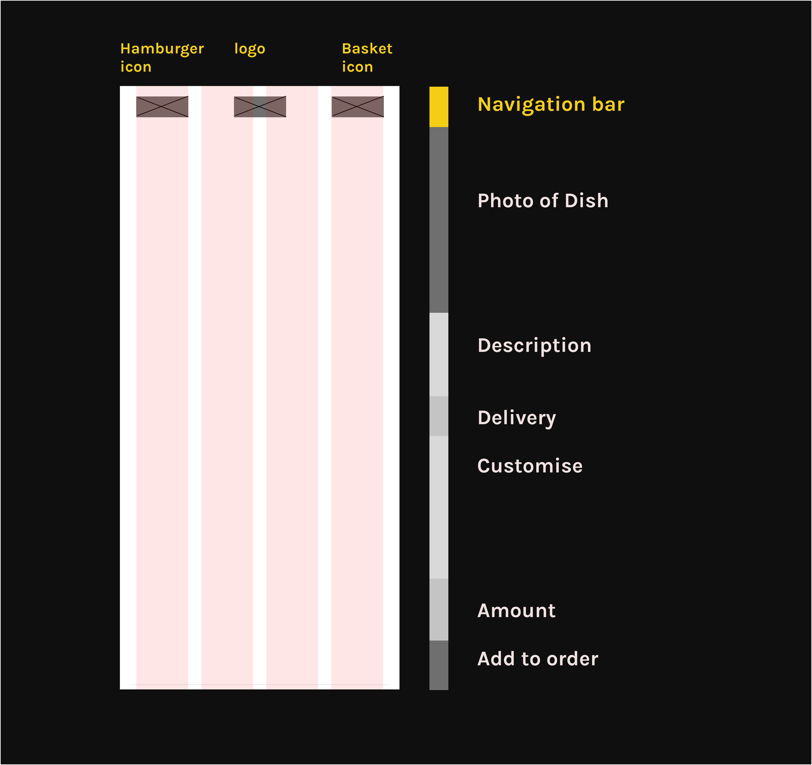  

<strong>Step 7 Placements</strong>

-   Add a placement for an image of a dish as a rectangle with an x through it.

-   And add a placement for the back button so users can return to the previous page.

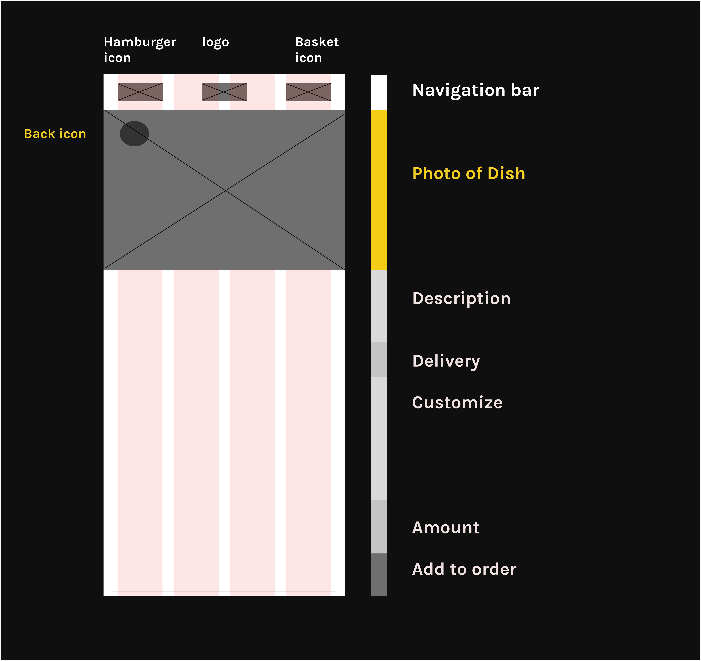  

<strong>Step 8: Description</strong>

-   Add a sub-heading for the name of the meal and its price.

-   Add body text to give a description.

<strong>Note:</strong> The wireframe does not have to include details at this point but is added here for demonstrative purposes.

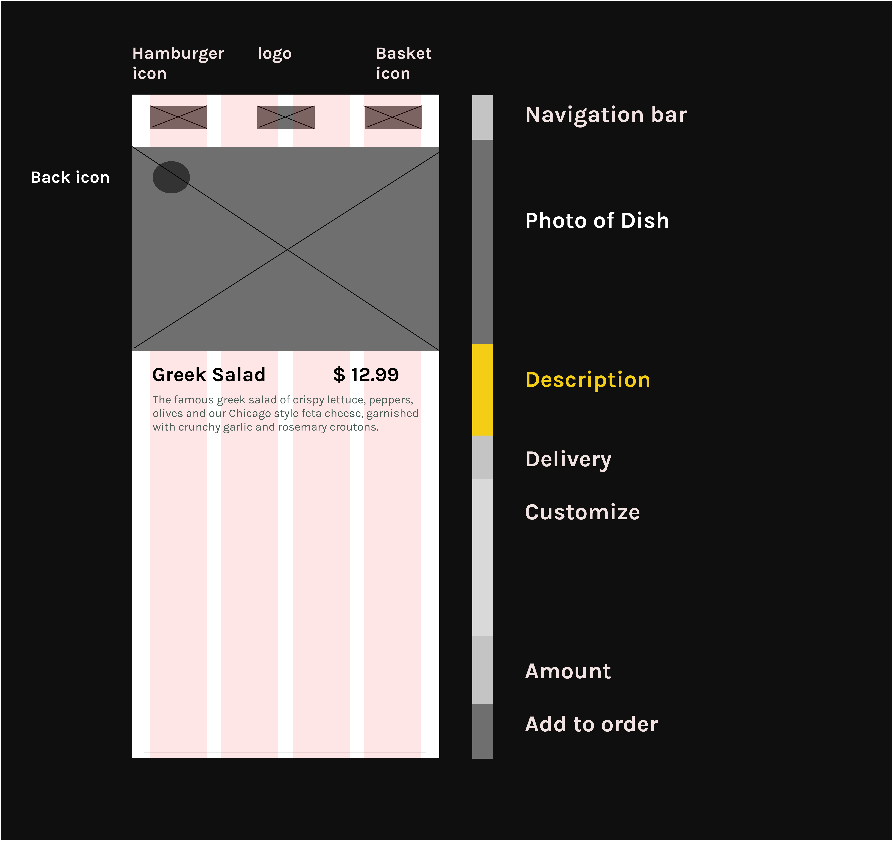  

<strong>Step 9:</strong> Delivery

-   Add an icon placement for a vehicle.

-   Add a general time for delivery.

-   Add a drop-down menu should a customer require another time for delivery.

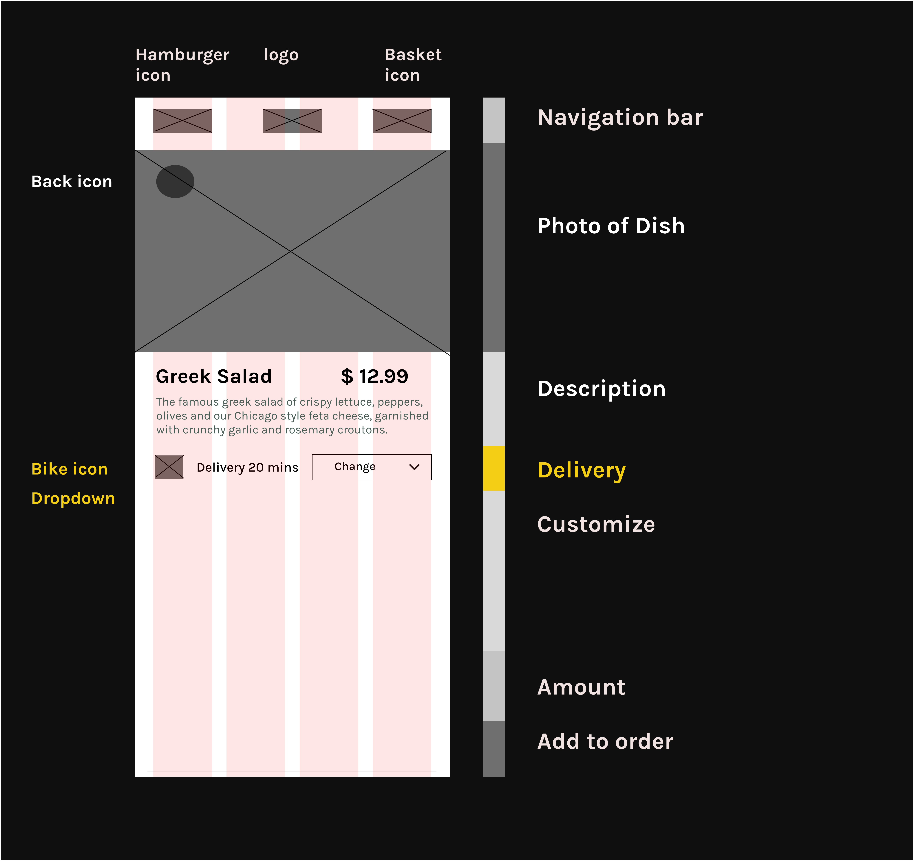  

<strong>Step 10: Customize</strong>

-   Add text to inform the user that they can add items to their dish.

-   List the options and price.

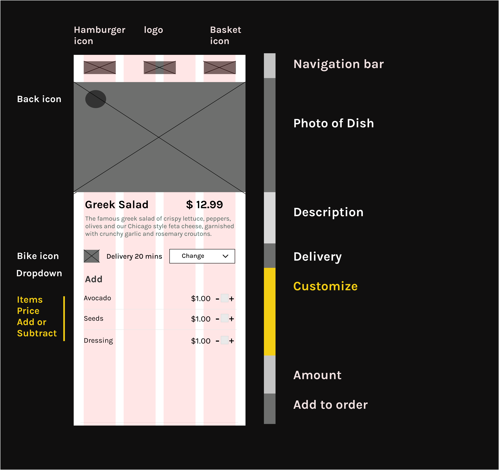  

<strong>Step 11: Number of dishes required</strong>

-   Add a plus and minus so users can add or subtract the number of the dish they want to order.

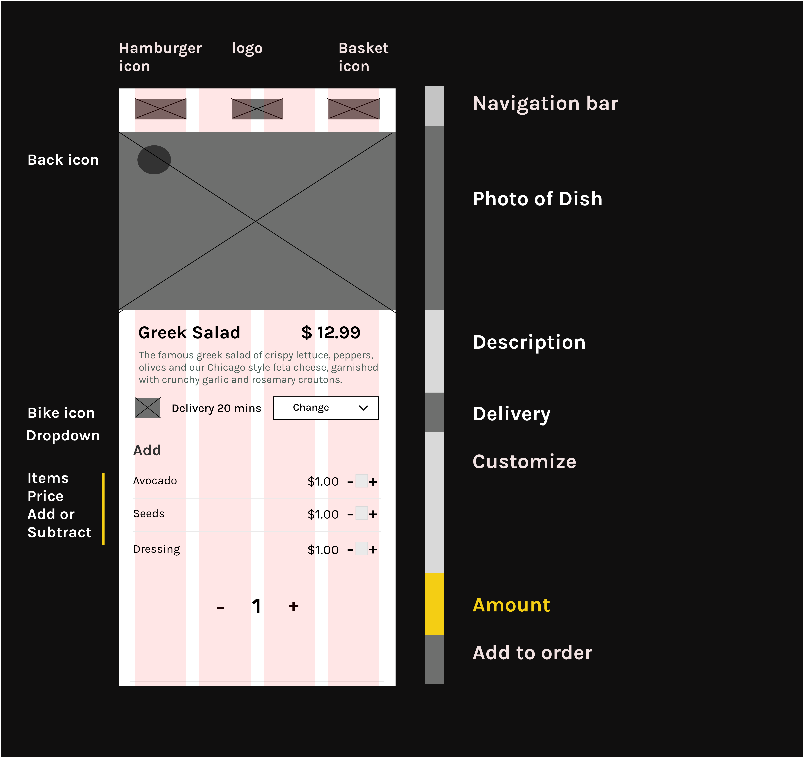  

<strong>Step 12: Add to order</strong>

-   Finally, add a button so users can tap to add a dish to their order.

-   And add a text placement displaying the total amount of the dish within this button.

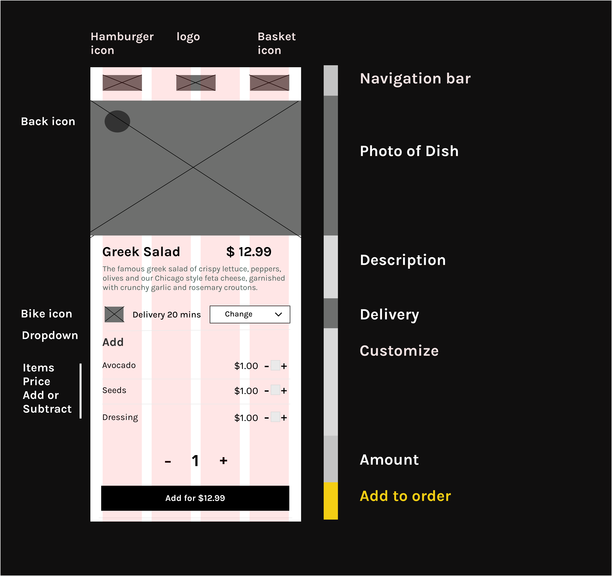
