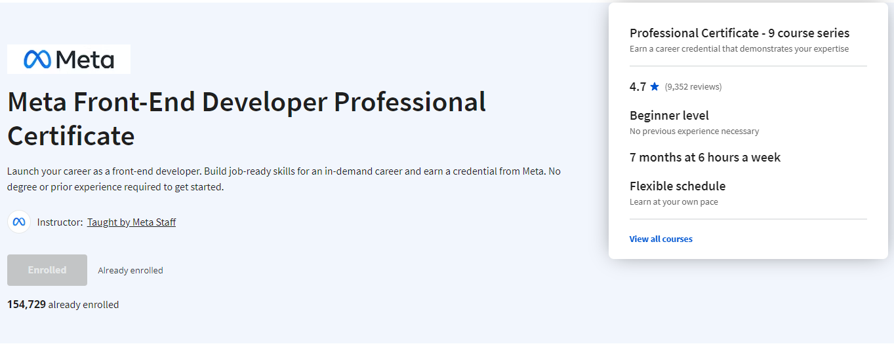

# Meta Front-End Developer Professional Certificate

## What you'll learn

-   Create a responsive website using HTML to structure content, CSS to handle visual style, and JavaScript to develop interactive experiences.
-   Learn to use React in relation to Javascript libraries and frameworks.
-   Learn Bootstrap CSS Framework to create webpages and work with GitHub repositories and version control.
-   Prepare for a coding interview, learn best approaches to problem-solving, and build portfolio-ready projects you can share during job interviews.

## Course 1 : [Introduction to Front-End Development](https://www.coursera.org/learn/introduction-to-front-end-development)

-   [Programming Assignment - Creating a HTML Document](/Course1-Introduction-to-Front-End-Development/1-Creating-a-HTML-Document)
-   [Programming Assignment - Styling a Page](/Course1-Introduction-to-Front-End-Development/2-Styling-a-Page)
-   [Programming Assignment - Create and Style a Webpage](/Course1-Introduction-to-Front-End-Development/3-Create-and-Style-a-Webpage)
-   [Lab - Working with Bootstrap grid](/Course1-Introduction-to-Front-End-Development/4-Lab-Working-with-Bootstrap-Grid/)
-   [Lab - Working with Bootstrap Components](/Course1-Introduction-to-Front-End-Development/5-Lab-Working-with-Bootstrap-Components/)
-   [Lab - Improve your Bio page with Bootstrap](/Course1-Introduction-to-Front-End-Development/6-Lab-Improve-your-Bio-Page-with-Bootstrap/)

### [Certificate of Completion](https://coursera.org/share/57c72c94f78302be01c359351247dd68)  

## Course 2 : [Programming With Javascript](/Course2-Programming-with-Javascript/)

-   [Lab Instructions - Building a Functional Program</fon>](/Course2-Programming-with-Javascript/1-Lab-Instructions-Building-a-Functional-Program)
-   [Programming Assignment - Building an object oriented program](/Course2-Programming-with-Javascript/2-Programming-Assignment-Building-an-object-oriented-program)
-   [Programming Assignment - Array and object iteration](/Course2-Programming-with-Javascript/3-Programming-Assignment-Array-and-object-iteration)
-   [Programming Assignment - Writing a Unit Test](/Course2-Programming-with-Javascript/4-Programming-Assignment-Writing-a-Unit-Test)
